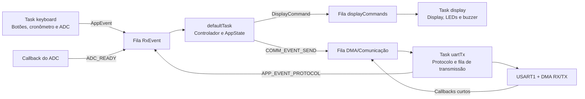
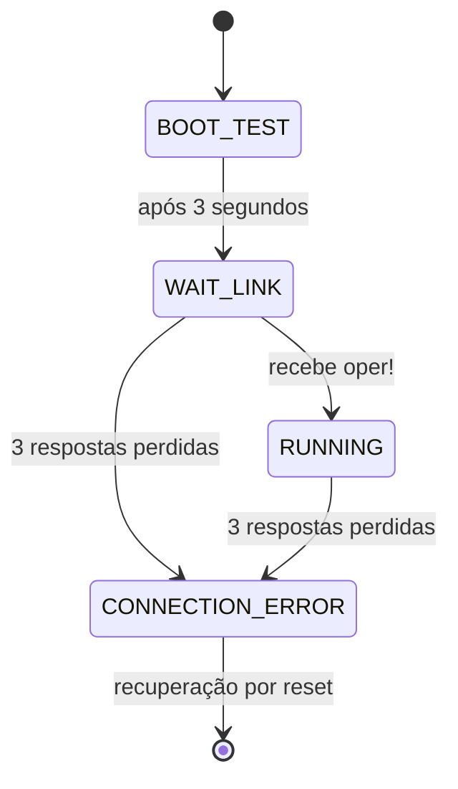

# Projeto PSE — STM32F103C8T6, FreeRTOS e UART com DMA

## 1. Visão geral

Este projeto implementa, sobre uma placa **STM32F103C8T6**, uma aplicação embarcada capaz de:

- ler três botões;
- medir uma entrada analógica pelo ADC;
- manter um cronômetro com resolução de décimos de segundo;
- controlar quatro LEDs, um buzzer e um display de quatro dígitos e sete segmentos;
- comunicar duas placas por UART;
- transferir os quadros UART com DMA;
- organizar a aplicação em tasks e filas do FreeRTOS/CMSIS-RTOS2;
- detectar perda da comunicação por meio de mensagens de PING/PONG.

O código evita esperas bloqueantes no fluxo da aplicação. Temporizações são baseadas no tick do RTOS, o ADC usa interrupção e a UART usa DMA nos dois sentidos.

## 2. Plataforma e configuração principal

| Item | Configuração |
|---|---|
| Microcontrolador | STM32F103C8T6, Cortex-M3 |
| Oscilador externo | HSE de 8 MHz |
| PLL | multiplicador ×9 |
| SYSCLK/HCLK | 72 MHz |
| APB1 | 36 MHz; timers do barramento a 72 MHz |
| APB2 | 72 MHz |
| Clock do ADC | 12 MHz, APB2 dividido por 6 |
| Debug | Serial Wire, por PA13/PA14 |
| RTOS | FreeRTOS com interface CMSIS-RTOS2 |
| Tick do RTOS | 1 kHz |
| Heap do RTOS | 8192 bytes |
| UART | USART1, 115200 bit/s, 8N1, sem controle de fluxo |
| ADC | ADC1, canal 0, 12 bits, conversão única por software |

O arquivo `proj_final_2026_pse.ioc` é a fonte das configurações do CubeMX. Alterações de periféricos, pinos, DMA ou tasks devem ser refletidas nele antes da regeneração do código.

## 3. Mapeamento de pinos

| Pino | Função | Observação |
|---|---|---|
| PA0 | ADC1_IN0 | entrada analógica |
| PA1 | botão A1 | entrada com pull-up; pressionado em nível baixo |
| PA2 | botão A2 | entrada com pull-up; pressionado em nível baixo |
| PA3 | botão A3 | entrada com pull-up; pressionado em nível baixo |
| PA9 | USART1_TX | conectar ao RX da outra placa |
| PA10 | USART1_RX | conectar ao TX da outra placa |
| PA13 | SWDIO | depuração/programação pelo ST-LINK |
| PA14 | SWCLK | depuração/programação pelo ST-LINK |
| PB5 | buzzer | ativo em nível baixo |
| PB15 | LED D1 | ativo em nível baixo |
| PB14 | LED D2 | ativo em nível baixo |
| PB13 | LED D3 | ativo em nível baixo |
| PB12 | LED D4 | ativo em nível baixo |
| PB10 | SDATA | dados para o 74HC595 do display |
| PB9 | SCLK | clock serial do 74HC595 |
| PB6 | RCLK | latch do 74HC595 |

Para conectar duas placas, deve-se cruzar TX e RX e compartilhar o terra:

```text
Placa A PA9/TX  ----> Placa B PA10/RX
Placa A PA10/RX <---- Placa B PA9/TX
Placa A GND      ---- Placa B GND
```

## 4. Arquitetura de software



### Princípios usados

1. **Estado centralizado:** somente a task controladora modifica `AppState`.
2. **Comunicação por mensagens:** tasks e callbacks publicam eventos em filas, em vez de alterar o estado global da aplicação.
3. **Callbacks curtos:** callbacks de ADC e UART apenas capturam o resultado e publicam um evento.
4. **Responsabilidade única:** comunicação, interface visual e entradas possuem executores próprios.
5. **Sem espera ocupada:** a aplicação usa deadlines e `osDelayUntil()`.
6. **Sem mutex desnecessário:** a propriedade clara dos dados reduz o compartilhamento concorrente.

## 5. Tasks do FreeRTOS

| Task | Função C | Prioridade | Stack configurada | Responsabilidade |
|---|---|---:|---:|---|
| `defaultTask` | `StartDefaultTask()` / `app_controller_run()` | Normal | 768 bytes | máquina de estados e regras da aplicação |
| `display` | `fn_display()` | Acima do normal | 512 bytes | multiplexação, animação, LEDs e buzzer |
| `uartTx` | `fn_uart_tx()` | Acima do normal | 640 bytes | RX/TX, codificação do protocolo e controle do DMA |
| `keyboard` | `fn_keyboard()` | Normal | 384 bytes | botões, debounce, cronômetro e disparo do ADC |

A task de display e a task de comunicação têm prioridade superior porque precisam atender eventos com baixa latência. A lógica da aplicação e a leitura dos botões permanecem em prioridade normal.

## 6. Filas e eventos

### `RxEvent`

Fila de entrada da aplicação, com 16 posições de `AppEvent`.

Eventos aceitos:

- `APP_EVENT_CHRONO_TICK`: incrementa o cronômetro;
- `APP_EVENT_ADC_READY`: entrega uma nova amostra do ADC;
- `APP_EVENT_BUTTON_EDGE`: informa o pressionamento de A1, A2 ou A3;
- `APP_EVENT_PROTOCOL`: entrega uma mensagem UART já validada.

### `DMA`

Apesar do nome herdado da configuração do projeto, esta é a fila de **eventos da comunicação**, com 16 posições de `CommEvent`. Ela não representa um canal físico do DMA.

Eventos aceitos:

- `COMM_EVENT_SEND`: solicita o envio de uma mensagem;
- `COMM_EVENT_RX_FRAME`: entrega um quadro recebido;
- `COMM_EVENT_TX_COMPLETE`: informa o término da transmissão;
- `COMM_EVENT_UART_ERROR`: solicita a recuperação da UART.

### `displayCommands`

Fila de seis comandos para a task de display. Cada `DisplayCommand` contém:

- quatro símbolos a exibir;
- máscara dos pontos decimais;
- LED que deve piscar;
- indicação de animação dos algarismos 8;
- solicitação e duração do buzzer.

Caso a fila fique cheia, o comando visual mais antigo é descartado para que a interface convirja para o estado mais recente.

## 7. Máquina de estados principal

O campo `AppState.phase` controla quatro fases:



### `APP_PHASE_BOOT_TEST`

- dura exatamente três segundos;
- mantém `8.8.8.8` aceso continuamente;
- ainda não aceita comandos dos botões.

### `APP_PHASE_WAIT_LINK`

- inicia o PING periódico;
- mantém a animação da cobra formando os quatro algarismos 8;
- aguarda a resposta `oper!` da outra placa.

### `APP_PHASE_RUNNING`

- habilita os botões;
- executa o serviço local/remoto;
- mantém o monitoramento da conexão;
- emite um beep de 200 ms ao entrar nesta fase.

### `APP_PHASE_CONNECTION_ERROR`

- é alcançado após três PONGs consecutivos ausentes;
- mostra a indicação de falha de conexão no display;
- interrompe os modos de serviço;
- exige reset para uma nova tentativa de conexão.

## 8. Comportamento dos botões

Os três botões são ativos em nível baixo e passam pelo mesmo algoritmo de polling e debounce. Um pressionamento somente é aceito após permanecer estável por 50 ms. Não existe lógica especial de clique duplo.

### A1 — exibição local

- habilita a exibição dos dados locais;
- alterna cronômetro e ADC a cada quatro segundos;
- associa o cronômetro ao LED D1/PB15;
- associa o ADC ao LED D2/PB14;
- se a placa estiver atendendo um pedido remoto, encerra o atendimento e envia `msnos`.

### A2 — solicitar serviço

- envia `rqsrv` para a outra placa;
- registra que existe uma solicitação pendente;
- limpa imediatamente um alerta `nSEr` anterior e desliga seu buzzer.

### A3 — encerrar solicitação

- envia `rqoff`;
- remove o registro de solicitação pendente.

Os botões são ignorados durante o teste inicial, a espera pela conexão e o estado de erro de comunicação.

## 9. Atendimento de serviço entre placas

Quando uma placa recebe `rqsrv`, ela entra no modo de atendimento e alterna quatro páginas a cada dois segundos:

| Página | Valor mostrado | LED |
|---:|---|---|
| 0 | cronômetro local | D1 / PB15 |
| 1 | ADC local | D2 / PB14 |
| 2 | cronômetro recebido | D3 / PB13 |
| 3 | ADC recebido | D4 / PB12 |

Durante esse modo, a placa solicita alternadamente o cronômetro e o ADC remotos a cada 90 ms. Até a chegada de um valor remoto válido, a respectiva página usa a animação dos quatro algarismos 8.

Ao receber `rqoff`, a placa encerra o atendimento. Se o usuário local pressionar A1 durante o atendimento, a placa também o encerra e envia `msnos` para informar que não atenderá ao serviço.

Se `msnos` for recebido enquanto há uma solicitação pendente, o display apresenta `nSEr` e o buzzer pulsa durante até cinco segundos. Pressionar A2 inicia uma nova solicitação e cancela imediatamente esse alarme.

## 10. Protocolo UART

Cada quadro possui **exatamente cinco bytes**, sem terminador `\n`, `\r` ou byte nulo.

| Quadro | Tipo interno | Significado |
|---|---|---|
| `oper?` | `PROTOCOL_PING` | pergunta se a outra placa está operando |
| `oper!` | `PROTOCOL_PONG` | confirma que a placa está operando |
| `rqsrv` | `PROTOCOL_REQUEST_SERVICE` | solicita serviço |
| `rqoff` | `PROTOCOL_STOP_REQUEST` | encerra a solicitação |
| `msnos` | `PROTOCOL_NO_SERVICE` | informa indisponibilidade do serviço |
| `rqcrn` | `PROTOCOL_REQUEST_CHRONO` | solicita o cronômetro |
| `rqadc` | `PROTOCOL_REQUEST_ADC` | solicita o ADC |
| `cMSSd` | `PROTOCOL_CHRONO_VALUE` | minuto, dois dígitos de segundos e décimo |
| `aVVVV` | `PROTOCOL_ADC_VALUE` | tensão em milivolts, de `0000` a `3300` |

Exemplos:

```text
c1234  -> 1 minuto, 23 segundos e 4 décimos
a3297  -> 3297 mV
```

`protocol_encode()` converte mensagens internas em quadros. `protocol_decode()` valida os cinco bytes e somente então publica a mensagem para a aplicação.

## 11. UART e DMA

A USART1 usa dois canais do DMA1:

| Operação | Canal | Direção | Modo |
|---|---|---|---|
| TX | DMA1 Channel 4 | memória para periférico | normal |
| RX | DMA1 Channel 5 | periférico para memória | normal |

### Recepção

1. `fn_uart_tx()` arma uma recepção de cinco bytes em `BufIN`.
2. O DMA transfere os bytes sem ocupar a CPU a cada byte.
3. `HAL_UART_RxCpltCallback()` copia o quadro para um `CommEvent`.
4. A recepção DMA seguinte é armada imediatamente.
5. A task UART valida e decodifica o quadro.
6. A mensagem resultante é enviada à `defaultTask` pela fila `RxEvent`.

### Transmissão

1. A controladora publica `COMM_EVENT_SEND`.
2. A task UART codifica o quadro e o armazena em uma fila circular interna de oito posições.
3. Se a UART estiver livre, o quadro é copiado para `BufOUT` e enviado por DMA.
4. `HAL_UART_TxCpltCallback()` informa o término.
5. A task libera a interface e inicia o próximo quadro pendente.

Em erro, a task aborta RX e TX, limpa o estado de transmissão e tenta armar novamente a recepção.

## 12. ADC e cronômetro

### ADC

- o ADC1 é calibrado uma vez no início da task `keyboard`;
- uma conversão por interrupção é iniciada a cada 500 ms;
- `HAL_ADC_ConvCpltCallback()` lê o resultado de 12 bits e publica um evento;
- a controladora converte a amostra para milivolts considerando VDD de 3300 mV.

A conversão usada é:

```text
tensão_mV = (amostra × 3300 + 2047) / 4095
```

O termo adicional realiza arredondamento inteiro.

### Cronômetro

- é incrementado a cada 100 ms;
- sua unidade interna é o décimo de segundo;
- varia de `0:00.0` a `9:59.9`;
- após 6000 décimos, retorna a zero.

## 13. Display, LEDs e buzzer

### Multiplexação

A task `display` atualiza um dígito a cada aproximadamente 6 ms. Os dígitos são armazenados internamente na ordem:

```text
índice 0 = unidade, índice 1 = dezena,
índice 2 = centena, índice 3 = milhar
```

`scan_display()` converte o símbolo com `conv_7_seg()`, acrescenta o ponto decimal e transmite os 16 bits ao 74HC595 por `serializar()`.

### Animação da cobra

Quando o estado visual normal seria `8.8.8.8`, a task executa continuamente três fases:

1. uma rota serpenteada atravessa o display;
2. a cobra desenha cada algarismo 8, alternando o sentido entre dígitos consecutivos;
3. os quatro algarismos completos permanecem acesos por 600 ms.

O fim do traçado de um dígito coincide com o início do próximo. Os LEDs D1–D4 acompanham o dígito ativo da animação.

No teste inicial de três segundos, a animação é propositalmente desabilitada: todos os segmentos e pontos ficam continuamente acesos para cumprir o autoteste.

### Buzzer

O buzzer é ativo em nível baixo:

- ao estabelecer a comunicação, permanece ligado por 200 ms;
- em `nSEr`, pulsa em intervalos de 200 ms por até cinco segundos;
- ao sair de `nSEr` com A2, o alarme é cancelado imediatamente.

## 14. Temporizações

| Constante lógica | Valor | Uso |
|---|---:|---|
| `BOOT_TEST_MS` | 3000 ms | teste inicial `8.8.8.8` |
| `PING_PERIOD_MS` | 250 ms | intervalo do monitor de conexão |
| `PING_MISSED_LIMIT` | 3 | respostas ausentes antes do erro |
| `CHRONO_PERIOD_MS` | 100 ms | incremento do cronômetro |
| `ADC_PERIOD_MS` | 500 ms | nova amostra do ADC |
| `REMOTE_REQUEST_PERIOD_MS` | 90 ms | solicitação de dado remoto |
| `LOCAL_PAGE_PERIOD_MS` | 4000 ms | alternância no modo local |
| `SERVICE_PAGE_PERIOD_MS` | 2000 ms | alternância durante o serviço |
| `DISPLAY_SCAN_PERIOD_MS` | 6 ms | varredura de um dígito |
| `OUTPUT_BLINK_PERIOD_MS` | 200 ms | LEDs e buzzer pulsante |
| `STARTUP_CHASE_PERIOD_MS` | 75 ms | passo da animação |
| `STARTUP_ALL_SEGMENTS_MS` | 600 ms | permanência dos quatro 8 completos |
| `READY_BEEP_MS` | 200 ms | aviso de sistema pronto |
| `NO_SERVICE_ALERT_MS` | 5000 ms | duração máxima de `nSEr` |
| `BUTTON_DEBOUNCE_MS` | 50 ms | estabilidade exigida do botão |

As constantes derivadas de `DT_*`, `NDIGSDISP`, `DIG_APAGADO` e os tokens do protocolo permanecem alinhados às definições fornecidas em `main.h`.

## 15. Código fornecido pelo professor e código da aplicação

O projeto preserva e reutiliza as estruturas fornecidas pelo professor.

### Reutilizado diretamente

- tokens `REQCRN`, `REQADC`, `REQSRV`, `REQOFF`, `MSGNSV`, `PNGPRG` e `PNGRSP`;
- constantes de temporização `DT_*`;
- `NDIGSDISP`, `DIG_APAGADO` e `VDD_VALUE`;
- `conv_7_seg()` para converter símbolos numéricos;
- `serializar()` para controlar o 74HC595;
- `conv_num_ASC()` e `conv_ASC_num()` para o protocolo;
- `reset_pinos_emula_SPI()` para inicializar a interface do display.

### Adaptação necessária

`mostrar_no_display()` não é chamada diretamente. A aplicação usa `scan_display()`, que continua reutilizando `conv_7_seg()` e `serializar()`, porque o projeto precisa de:

- zeros à esquerda em valores de quatro posições;
- símbolos adicionais para as mensagens de estado;
- controle individual dos pontos decimais;
- animação de segmentos da cobra.

Portanto, o driver físico fornecido foi mantido; apenas a política de composição e varredura foi especializada para os requisitos atuais.

## 16. Organização dos arquivos

| Caminho | Conteúdo |
|---|---|
| `proj_final_2026_pse.ioc` | configuração do CubeMX |
| `Core/Src/main.c` | arquitetura, tasks, estados e regras da aplicação |
| `Core/Inc/main.h` | tokens, constantes e declarações fornecidas |
| `Core/Src/funcoes_SPI_display.c` | conversões e driver serial do display |
| `Core/Inc/funcoes_SPI_display.h` | interface do driver de display |
| `Core/Src/stm32f1xx_hal_msp.c` | GPIOs alternativos, ADC, UART e DMA |
| `Core/Src/stm32f1xx_it.c` | handlers de interrupção gerados |
| `Core/Inc/FreeRTOSConfig.h` | configuração do kernel |
| `Drivers/` | HAL e CMSIS da ST |
| `Middlewares/` | FreeRTOS e camada CMSIS-RTOS2 |

## 17. Compilação e gravação

No STM32CubeIDE:

1. importe o diretório como projeto existente;
2. selecione a configuração `Debug`;
3. execute **Project > Clean** se o código tiver sido regenerado;
4. execute **Build Project**;
5. conecte o ST-LINK pelos sinais SWDIO, SWCLK, GND e alimentação compatível;
6. use **Run** para gravar ou **Debug** para iniciar uma sessão de depuração.

O diretório `Debug/` contém artefatos gerados e não deve ser versionado.

## 18. Roteiro mínimo de testes

1. **Reset:** confirmar `8.8.8.8` estático durante três segundos.
2. **Espera:** confirmar início da animação da cobra após os três segundos.
3. **Conexão:** ligar as duas placas e confirmar o beep curto de prontidão.
4. **A1:** confirmar alternância local cronômetro/ADC a cada quatro segundos.
5. **A2:** confirmar envio de `rqsrv` e comportamento de serviço na outra placa.
6. **Serviço:** confirmar as quatro páginas e LEDs D1–D4 a cada dois segundos.
7. **A3:** confirmar envio de `rqoff` e encerramento do serviço remoto.
8. **Recusa:** provocar `msnos`, confirmar `nSEr` e buzzer pulsante.
9. **Nova tentativa:** durante `nSEr`, pressionar A2 e confirmar que o buzzer para imediatamente.
10. **Falha de link:** desconectar a UART e confirmar a indicação após três respostas perdidas.
11. **ADC:** aplicar tensões conhecidas entre 0 e 3,3 V e comparar a leitura.
12. **Cronômetro:** confirmar incremento de 0,1 s e retorno a zero após `9:59.9`.

## 19. Cuidados ao modificar

- mantenha callbacks de interrupção curtos e não use `osDelay()` dentro deles;
- use timeout zero ao publicar eventos a partir de callbacks;
- não modifique `AppState` fora da task controladora;
- não escreva diretamente no display, LEDs ou buzzer fora da task `display`;
- não altere `BufOUT` enquanto uma transmissão DMA estiver ativa;
- preserve o tamanho fixo de cinco bytes do protocolo;
- altere pinos, DMA e tasks primeiro no arquivo `.ioc`;
- mantenha código manual dentro das regiões `USER CODE` para sobreviver à regeneração do CubeMX.

